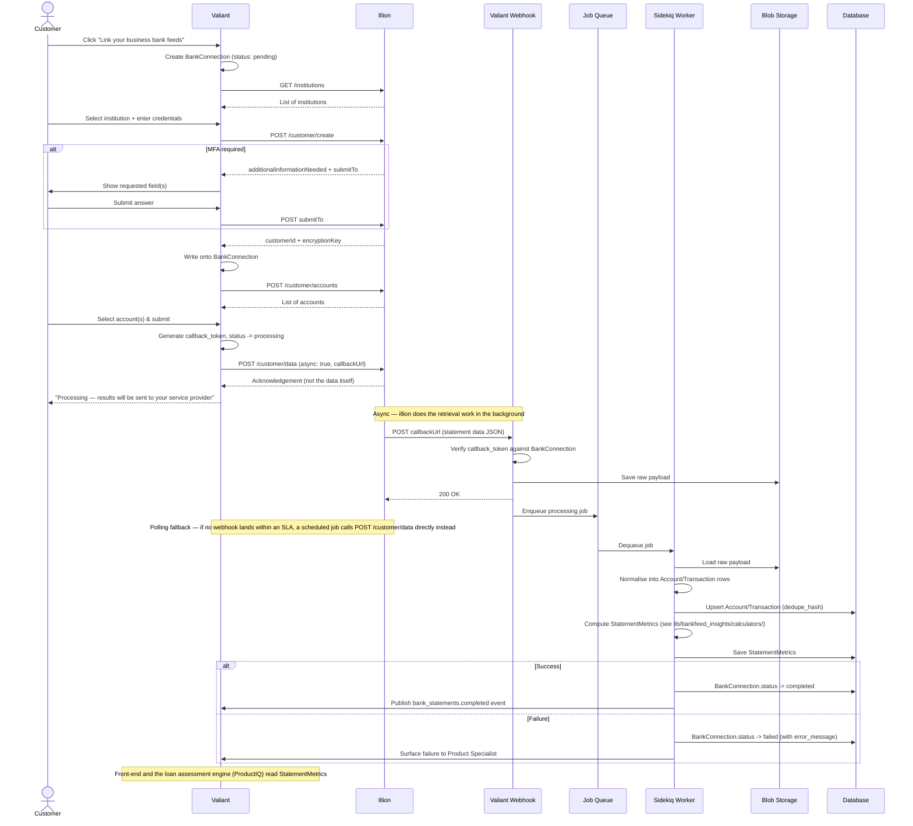

# Bank Statement Integration — Overview

A single end-to-end view of the flow described in
[`illion-integration-flow.md`](illion-integration-flow.md) (linking,
authentication, triggering retrieval) and
[`data-processing-and-storing.md`](data-processing-and-storing.md) (webhook
processing, storage, availability). For the underlying database schema, see
[`schema.md`](schema.md).

