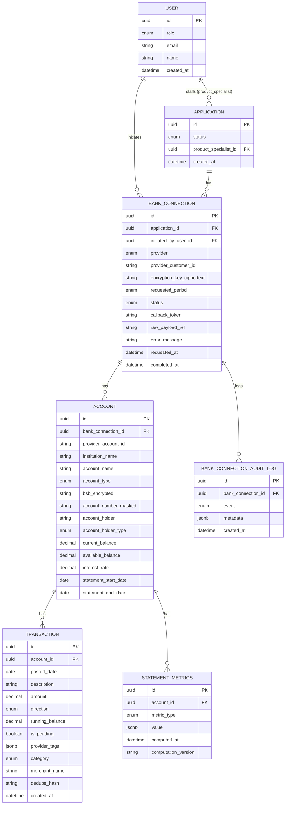

# Bank Statement Integration — Schema

For the request/response workflow (linking, authentication, async retrieval,
storage, security), see [`illion-integration-flow.md`](illion-integration-flow.md)
and [`data-processing-and-storing.md`](data-processing-and-storing.md). This
doc covers just the primary database objects and their relationships.

## 1. Data Models

```
User (Valiant platform user — could be a signatory/customer or a staff member)
├── id                    PK
├── role                  enum: customer, product_specialist, staff
├── email
├── name
└── created_at

Application (a loan/deal — VA-268352 in the mockups)
├── id                    PK
├── status                enum
├── product_specialist_id FK -> User
└── created_at

BankConnection (one illion "customer" object per bank-linking session)
├── id                          PK
├── application_id              FK -> Application
├── initiated_by_user_id        FK -> User        (the signatory, e.g. Peter Parker)
├── provider                    enum: illion        (future-proofs for other CDR providers)
├── provider_customer_id        illion `customerId` (UUID)
├── encryption_key_ciphertext   illion `encryptionKey`, envelope-encrypted at rest
├── requested_period            enum: last_3_months, last_6_months, last_12_months, none
├── status                      enum: pending, mfa_required, processing, completed, failed, expired
├── callback_token              opaque, single-use, used to authenticate illion's webhook
├── raw_payload_ref              pointer to raw JSON in blob storage (S3/GCS), NOT inline
├── error_message               nullable
├── requested_at
└── completed_at

Account (one per bank account returned by illion, belongs to a BankConnection)
├── id                    PK
├── bank_connection_id    FK -> BankConnection
├── provider_account_id   illion `id` (scoped to the connection, not globally unique)
├── institution_name      e.g. "Bank of Statements"
├── account_name          e.g. "Transaction Account"
├── account_type          enum: transaction, savings, credit_card, loan, other
├── bsb_encrypted
├── account_number_masked  store last 4 only; never persist full PAN/account number in plaintext
├── account_holder
├── account_holder_type   enum: single, joint
├── current_balance
├── available_balance
├── interest_rate         nullable
├── statement_start_date
├── statement_end_date
└── opening_balance / closing_balance / total_credits / total_debits (denormalised summary fields)

Transaction (child of Account — the largest table by row count)
├── id                    PK
├── account_id            FK -> Account
├── posted_date
├── description           raw text from provider
├── amount                decimal, signed (or store `amount` + `direction` — pick one convention)
├── direction              enum: credit, debit
├── running_balance        balance-after-transaction, as supplied by provider
├── is_pending
├── provider_tags          jsonb — raw tags from illion (Income, Gambling, Loans, Rent, ...)
├── category               enum, our own normalised categorisation (see below)
├── merchant_name          nullable, extracted/normalised
├── dedupe_hash            hash(account_id + date + amount + description) — see idempotency note
└── created_at

StatementMetrics (one row per Account per calculation run — the output of Part 3-style analysis)
├── id                    PK
├── account_id            FK -> Account
├── metric_type           enum: avg_monthly_income, gambling_pct_of_expenditure,
│                                short_term_lender_exposure, ...
├── value                 jsonb (metric-specific shape, e.g. {amount, count, period})
├── computed_at
└── computation_version   so we can tell which version of the scoring logic produced it

BankConnectionAuditLog
├── id
├── bank_connection_id
├── event                 enum: link_initiated, mfa_challenge, webhook_received,
│                                data_stored, metrics_computed, failed
├── metadata (jsonb, no PII/secrets)
└── created_at
```

**Relationships**

```
Application 1──* BankConnection 1──* Account 1──* Transaction
                                   Account 1──* StatementMetrics
BankConnection 1──* BankConnectionAuditLog
```

**ER Diagram**



Design notes:
- `BankConnection` is the aggregate root for one illion linking session — it
  is deliberately separate from `Application` so a customer can re-link (MFA
  expired, added an account) without orphaning history.
